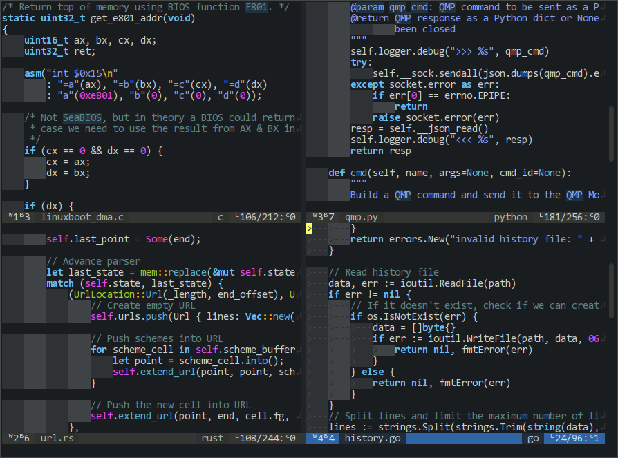
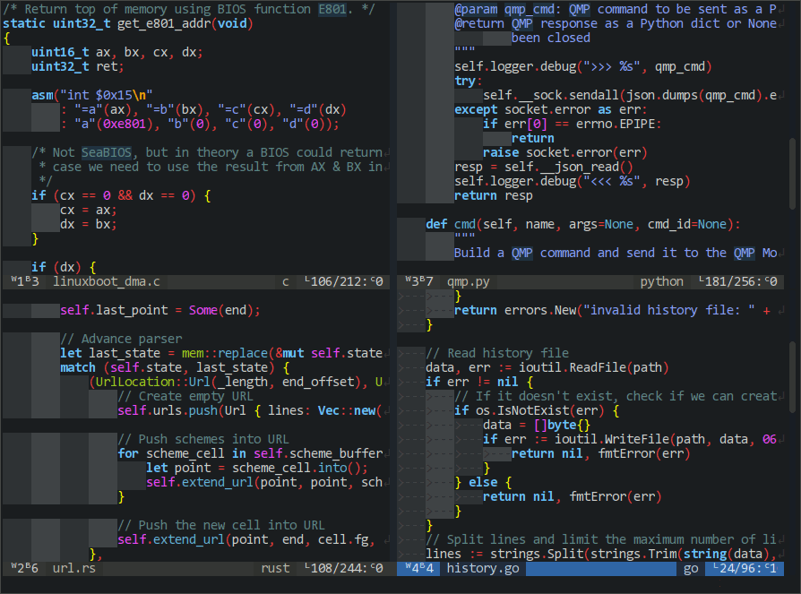

This plugin was initially created for [codeblock_dark color theme](https://github.com/noscript/codeblocks-dark.vim)
to highlight operators (`+`, `-`, `/`, `*`, `=`, `<`, `>`, `(`, `)` and others) in C-like languages.
Why it's needed? Well, by default vim doesn't do that. After switching from Code::Block to vim I got really missed it.

Then the plugin grew into something bigger. I started to use it to unify overal syntax highlighting for C-like languages.

# Screenshots

Before:



After:



# Installation

There are two ways to enable the plugin:

1. If you want to use `CSyntaxAfter` highlighting as is, put this into your
`.vimrc`:
```vim
autocmd! FileType c,cpp,java,php call CSyntaxAfter()
```

2. If you also want to extend the highlighting or add other C-like languages
support (Java, Go etc), create a corresponding `<filetype>.vim` file in
`.vim/after/syntax/` and call `CSyntaxAfter()` from there instead.

WARNING: For same file type use either option (1.) or (2.), basically avoid calling
`CSyntaxAfter()` more than once.

For example, to distinguish `++` and `--` operator from `+` and `-` in C and C++,
remove `c` and `cpp` from autocmd above and instead create `.vim/after/syntax/c.vim`
with (cpp syntax is based on c):

```vim
if exists("*CSyntaxAfter")
  call CSyntaxAfter()
endif

syntax match longOperators "++\|--"
hi longOperators guifg=green guibg=red
```
